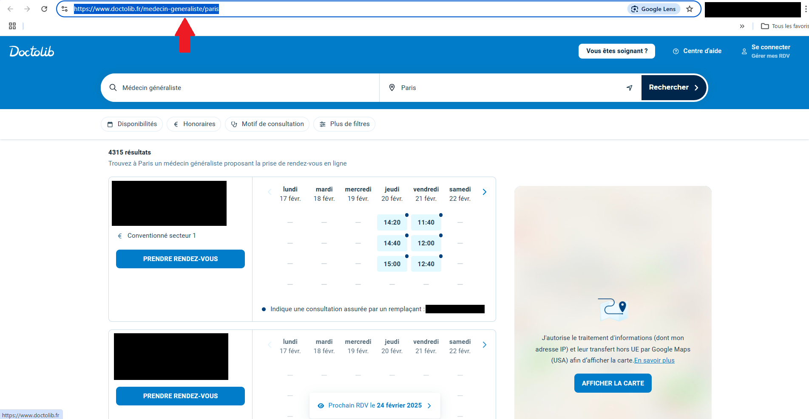

# Doctolib Scraper

Doctolib Scraper is a python program that scraps doctors informations into a yaml file.

The program is meant to be run locally.


## Warning

Don't over use this project. Doctolib has a antiscrap policy, meaning that you could get banned from the website if you scrap it too much.

But don't worry, I have personnaly run this script (and previous more aggressive ones) like 40 times in a short period of time, and didn't have any problem. Only a cloudflare at one point, but it quickly disapeared when I came back to a normal navigation on the website for some days.

Still, even if there's no consequences for you, please remain respectful of their website by making a reasonable amount of requests to it.


## Motivation

The initial goal of this project goes beyond simply scraping data from Doctolib. The ultimate objective is to classify practitioners in a spreadsheet based on certain criteria. The most important one for me is accessibility from my home. Since I don’t own a car, some practitioners are difficult to reach via public transportation.

To avoid the tedious task of manually checking each practitioner's page, copying their address, going to the public transport website, simulating a route from my home, and retrieving the total travel time and walking time, I decided to create this project.

The first step is to collect essential information from Doctolib, that is what this program does.

Next, the Google Maps API is used to simulate a route from my home to the practitioner's location, allowing me to calculate the travel time.

The final step is to format the gathered and computed data in a Google Sheet using its API.

I haven’t included the last two parts because they rely on GCP APIs, which would require explaining how to set them up. I’d also need to refactor my code to better integrate someone else’s credentials. Given the complexity of using these APIs, I believe very few people (if any) would be interested in this functionality.

However, if you're interested in this additional feature, feel free to reach out to me on Reddit (you’ll find my profile link on my GitHub profile).


## Installation

If you don't have python on your computer, install it.

Clone the project

```bash
  git clone https://github.com/gagota/doctolib-scrapper.git
```

Go to the project directory

```bash
  cd doctolib-scrapper
```

Create and activate a virtual environment (Optional, recommended)

```bash
  python -m venv doctolib_env
```
```bash
  . .\doctolib_env\Scripts\activate
```

Install dependencies

```bash
  pip install -r requirements.txt
```    
## Usage 

First, you need to make your search on doctolib.fr.


Then, when on the search page, copy the url of the page.



Open '_main.py' (in the 'src' folder) with your prefered IDE (like VS Code).

Paste the url in the `doctolib_search_url` variable.

[Script '_main.py' paste url in `doctolib_search_url`]

Enter a search name in the `search_name` variable. It will be the name of the folder containing the gathered data.

[Change `search_name`]

You can tweak the parameters as you like in the `parameters` object.

Play the script, and watch the magic happen before your eyes ;)
